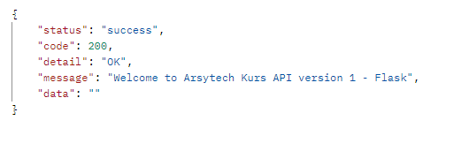

## kurs-api-flask
Repositori ini dibuat untuk mengembangkan project Kurs mata uang semua negara. 
Repositori ini dikembangkan dengan bahasa pemrograman Python dan menggunakan framework Flask versi 2.3.3

### 🚀 Cara menjalankan program

> Penting !!
> Sangat disarankan menggunakan WSL versi 2 sebagai lingungan pengembangan sistem yang baik.

1. Setelah program ini berhasil di clone, masuk ke folder root program. seharusnya namanya adalah `/kurs-api-flask`.
2. Jalankan perintah berikut: `python3 -m venv .venv`.
3. Kemudian jalankan perintah berikut: `source .venv/bin/activate`.
4. Kemudian jalankan perintah berikut: `pip install -r requirements.txt`.
5. Kemudian jalankan perintah berikut: `python run.py`.

Maka seharusnya program sudah berhasil dijalankan di localhost port 5000.

Silahkan Lakukan uji coba dengan menggunakan POSTMAN. dockumen postman ada di folder `/docs/postman`.